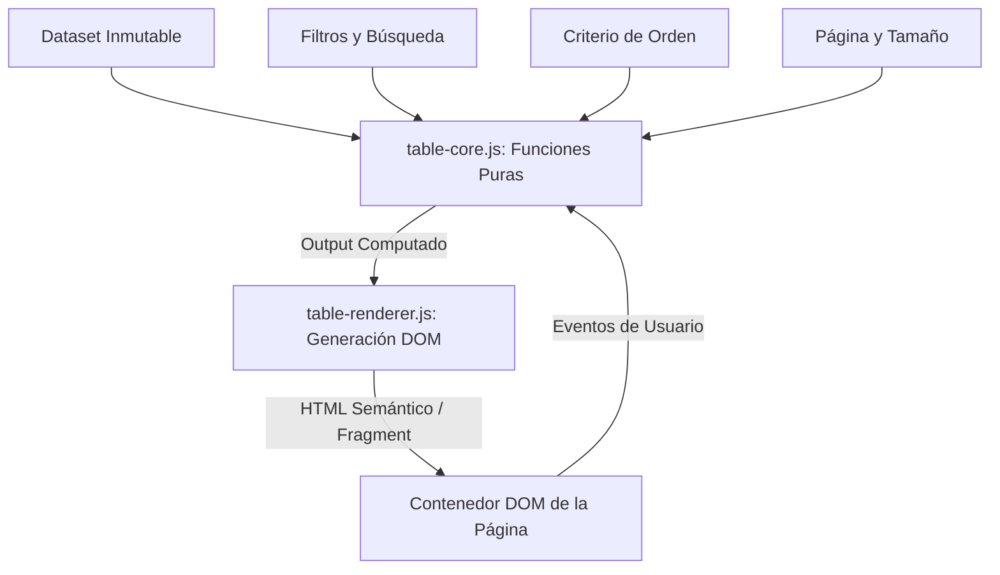

# Arquitectura del Frontend: FONAG SEDC

Documentación arquitectónica oficial para la modernización de la plataforma web del **SEDC (Sistema de Estandarización de Datos Crudos Hidroclimáticos de FONAG)**.

---

## 1. Principios de Ingeniería y Filosofía

1. **Concepts > Code**: Estructuras sólidas, separación estricta de responsabilidades (SoC) y diseño antes que frameworks.
2. **Cero Dependencias Pesadas**: Erradicación total de librerías legadas como **jQuery** y **Bootstrap 5**, y evasión de runtimes pesados virtuales (React/Preact).
3. **Atomic Design Riguroso**: Estructuración modular en capas atómicas: *Tokens -> Átomos -> Moléculas -> Organismos -> Plantillas -> Páginas*.
4. **Programación Funcional en Vanilla JS**:
   - Funciones puras para cómputo de datos (inmutabilidad, sin efectos secundarios).
   - Renderizadores puros desacoplados de la lógica de negocio.
   - Flujo de datos unidireccional: `Estado -> Acción -> Cómputo Puro -> Render`.
5. **Arquitectura Multi-Page (MPA)**: Mapeo nativo de URLs del navegador con las aplicaciones del backend Django SEDC original (`/`, `/estaciones/`, `/variables/`).

---

## 2. Árbol de Directorios del Proyecto

```
FONAG/
├── index.html                           # Landing Page / Portal Principal (Aislado)
├── estaciones/
│   └── index.html                       # Página del módulo de Estaciones (MPA)
├── src/
│   ├── css/
│   │   ├── main.css                     # Entrada CSS principal (Vite + Tailwind v4 Bridge)
│   │   ├── tokens/                      # Tokens de Diseño Canónicos
│   │   │   ├── colors.css               # Paleta de 30 colores extraída del manual de marca
│   │   │   ├── typography.css           # Inter (pesos 400, 500, 600, 700, 800)
│   │   │   ├── spacing.css              # Escala modular de espaciado y contenedores
│   │   │   ├── borders.css              # Radios (8px estándar en botones, etc.)
│   │   │   └── index.css                # Índice agregador de tokens
│   │   ├── atoms/                       # Bloques indivisibles
│   │   │   ├── buttons.css              # Botones primarios, CTA naranja, outline
│   │   │   ├── inputs.css               # Campos de texto, selectores
│   │   │   ├── badges.css               # Chips de estado y tipo
│   │   │   └── social-link.css          # Enlaces sociales con SVG
│   │   ├── molecules/                   # Combinación de átomos
│   │   │   ├── nav-menu.css             # Menú de enlaces con subrayado activo
│   │   │   ├── hero-search.css          # Cápsula flotante de búsqueda
│   │   │   ├── stat-card.css            # Tarjeta de cifras con acento cian
│   │   │   ├── constituent-item.css     # Medallón circular de logos institucionales
│   │   │   └── data-table.css           # Estilos de la tabla de datos semántica
│   │   ├── organisms/                   # Secciones de interfaz completas
│   │   │   ├── portal-header.css        # Encabezado principal y navegación
│   │   │   ├── hero-portal.css          # Hero con fondo de cuenca y SEDC lockup
│   │   │   ├── stats-section.css        # Cuadrícula responsiva de 4 cifras clave
│   │   │   ├── constituents-carousel.css# Carrusel con flechas al 50% del borde
│   │   │   └── footer.css               # Pie de página de 2 niveles corporativo
│   │   └── templates/
│   │       └── layout.css               # Contenedores con max-width: 1366px
│   │
│   └── js/
│       ├── main.js                      # Bootstrap del Portal Principal
│       ├── atoms/
│       │   └── button.js                # Comportamiento accesible y ripple de botones
│       ├── molecules/
│       │   ├── search.js                # Lógica del buscador reactivo
│       │   └── data-table/              # MOTOR FUNCIONAL DE TABLAS
│       │       ├── table-core.js        # Funciones puras (filtro, sort, paginación, CSV)
│       │       ├── table-renderer.js    # Generadores puros de DOM / HTML semántico
│       │       └── data-table.js        # Orquestador del componente (Factory Pattern)
│       ├── organisms/
│       │   ├── theme-toggle.js          # Modo claro/oscuro
│       │   └── constituents-carousel.js # Controlador de Embla Carousel
│       └── pages/
│           └── estaciones.js            # Controlador específico de la vista de Estaciones
├── vite.config.js                       # Configuración MPA de Vite (Rollup inputs)
└── package.json                         # Dependencias y scripts de linting/build
```

---

## 3. Capa de Diseño y Design Tokens

### 3.1. Colores Semánticos Principales
- **Azul Primario (Brand Navy)**: `#242857` (Texto principal, títulos H1/H2, fondos del footer).
- **Naranja Acento (Brand Orange)**: `#F19001` (Eyebrows, botones CTA, subrayados activos, acentos de interacción).
- **Cian Acento (Data / Water)**: `#41A6E5` (Indicadores de cifras métricas e íconos hidroclimáticos).
- **Fondos de Superficie**: `#FFFFFF` (Tarjetas), `#F8FAFC` (Contenedores secundarios).

### 3.2. Restricciones Canónicas
- **Contenedor Máximo**: `1366px` (`--container-max-width`).
- **Radio de Botones**: `border-radius: 8px;`.
- **Tipografía Base**: `Inter, system-ui, sans-serif`. Pesos estrictos: `400` (Regular), `500` (Medium), `600` (SemiBold), `700` (Bold).

---

## 4. Comparativa de Arquitectura: SEDC Legado vs. Frontend Moderno

| Área | SEDC Original (`paulchicaiza/sedc`) | Frontend Moderno FONAG | Razón de Ingeniería |
| :--- | :--- | :--- | :--- |
| **Pila Tecnológica** | Django Templates + Bootstrap 5 + jQuery | Vite + Vanilla JS + CSS Tokens | Rendimiento, cero dependencias pesadas, mantenibilidad |
| **Motor de Tablas** | `Bootstrap Table` v1.21.0 sobre jQuery | `DataTable` funcional en Vanilla JS nativo | Control 100% estético con tokens, código testeable y modular |
| **Manipulación de Datos** | Procedural en `functions.js` | Funciones puras e inmutables en `table-core.js` | Previene efectos secundarios y condiciones de carrera |
| **Navegación** | Django Views / URL routing | Multi-Page Application (MPA) con Vite | Mapeo 1:1 de URLs sin complejidad de routers SPA |
| **Componentes Visuales** | Monolito CSS Bootstrap | Atomic Design modular (`tokens/`, `atoms/`, etc.) | Escalabilidad y consistencia de diseño visual |

---

## 5. Arquitectura del Motor Funcional de Tablas (`table-core.js`)

El componente de tabla no acopla la lógica de negocio al DOM. Se estructura en tres capas desacopladas:



### 5.1. Funciones Puras (`table-core.js`)
- `filterRows(rows, filters, searchFields)`: Genera un nuevo array filtrado sin mutar el original.
- `sortRows(rows, key, direction)`: Ordena inmutablemente por claves anidadas o directas.
- `paginateRows(rows, page, pageSize)`: Calcula el slice exacto de datos e índices `start/end/total`.
- `exportRowsToCsv(columns, rows, filename)`: Construye un RFC4180 CSV y dispara descarga nativa vía `Blob`.

### 5.2. Renderizadores Puros (`table-renderer.js`)
- `renderHeader(columns, sortState)`: Emite `<thead>` con encabezados accesibles y flechas de ordenamiento SVG.
- `renderBody(columns, pageRows, formatters)`: Emite `<tbody>` aplicando formateadores desacoplados para celdas y botones de acción.
- `renderPagination(paginationState)`: Genera controles de página anterior, siguiente, páginas numeradas e indicador "Mostrando X de Y".

---

## 6. Pipeline de Calidad y Verificación

- **CSS Linting**: `stylelint "src/css/**/*.css"` con `stylelint-config-standard`.
- **JS Linting**: `eslint "src/js/**/*.js"` con ESLint v9 Flat Config.
- **Production Build**: `vite build` con validación cruzada de todos los puntos de entrada MPA.
